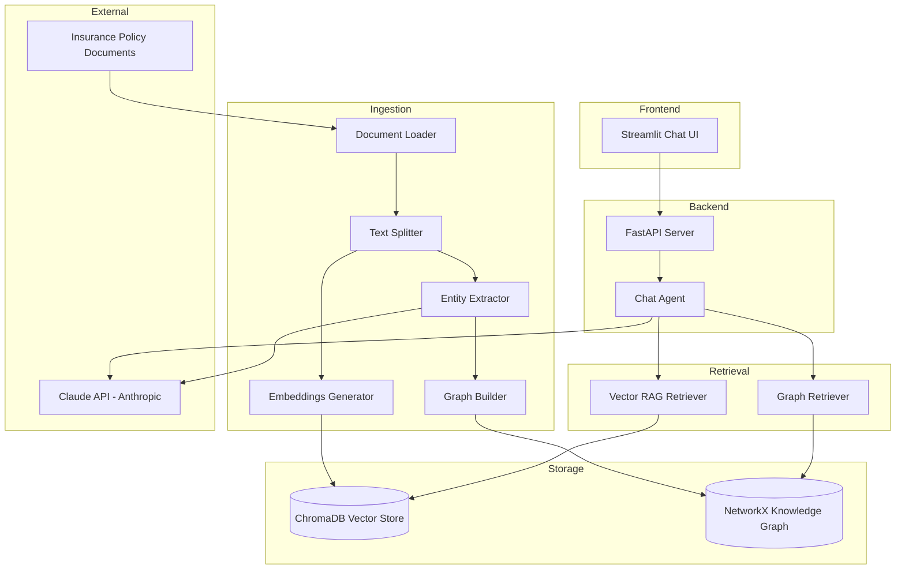

# Insurance Policy Advisor - RAG + GraphRAG System

An AI-powered insurance policy advisor that uses Retrieval-Augmented Generation (RAG) and GraphRAG to answer customer questions about insurance coverage, exclusions, limits, and conditions.

## Table of Contents

1. [Architecture Overview](#architecture-overview)
2. [Project Structure](#project-structure)
3. [Dependencies](#dependencies)
4. [Setup and Installation](#setup-and-installation)
5. [Configuration](#configuration)
6. [Running the Application](#running-the-application)
7. [Document Ingestion](#document-ingestion)
8. [API Endpoints](#api-endpoints)
9. [Testing](#testing)
10. [Docker Deployment](#docker-deployment)
11. [How It Works](#how-it-works)

---

## Architecture Overview



### End-to-End Flow

1. **Ingestion**: Insurance documents (PDF/DOCX/TXT) are loaded, split into chunks, embedded via sentence-transformers, and stored in ChromaDB. Entities are extracted via Claude and stored in a NetworkX knowledge graph.
2. **Query**: Customer asks a question via the Streamlit UI.
3. **Retrieval**: The question is searched against ChromaDB (semantic similarity) and the knowledge graph (keyword + relationship traversal).
4. **Generation**: Both contexts are injected into a prompt, and Claude generates a grounded answer with source citations.

---

## Project Structure

```
insurance-policy-advisor/
├── pyproject.toml              # Poetry dependency management
├── Dockerfile                  # API container image
├── Dockerfile.streamlit        # UI container image
├── docker-compose.yml          # Multi-service orchestration
├── .env.example                # Environment variable template
├── .gitignore                  # Git ignore patterns
├── config/
│   ├── settings.yaml           # Application configuration
│   └── logging.yaml            # Logging configuration
├── data/
│   └── sample_policies/        # Synthetic insurance documents
├── src/
│   ├── main.py                 # FastAPI application entry point
│   ├── config/                 # Configuration loader
│   ├── ingestion/              # Document loading and chunking
│   ├── rag/                    # Vector-based retrieval (ChromaDB)
│   ├── graph_rag/              # Knowledge graph retrieval (NetworkX)
│   ├── agent/                  # LLM client and chat orchestration
│   ├── api/                    # FastAPI routes and schemas
│   └── utils/                  # Logging and shared utilities
├── ui/
│   └── streamlit_app.py        # Chat frontend
├── tests/                      # Unit test suite
└── scripts/
    └── ingest_documents.py     # CLI ingestion script
```

---

## Dependencies

| Component | Version | Purpose |
|-----------|---------|---------|
| Python | ^3.11 | Runtime |
| FastAPI | ^0.115.0 | REST API framework |
| Uvicorn | ^0.32.0 | ASGI server |
| Anthropic | ^0.42.0 | Claude LLM client |
| ChromaDB | ^0.5.0 | Vector database |
| Sentence-Transformers | ^3.3.0 | Embedding model |
| NetworkX | ^3.4.0 | Knowledge graph |
| PyPDF2 | ^3.0.0 | PDF parsing |
| python-docx | ^1.1.0 | DOCX parsing |
| Streamlit | ^1.40.0 | Chat UI |
| Pydantic | ^2.10.0 | Data validation |
| Tenacity | ^9.0.0 | Retry logic |

---

## Setup and Installation

### Prerequisites

- Python 3.11 or higher
- [Poetry](https://python-poetry.org/docs/#installation) package manager
- An [Anthropic API key](https://console.anthropic.com/)

### Installation Steps

1. **Clone the repository**:
   ```bash
   git clone <repository-url>
   cd ai-genai-usecases-insurance-policy-advisor
   ```

2. **Install dependencies with Poetry**:
   ```bash
   poetry install
   ```

3. **Set up environment variables**:
   ```bash
   cp .env.example .env
   # Edit .env and add your ANTHROPIC_API_KEY
   ```

4. **Verify installation**:
   ```bash
   poetry run pytest tests/ -v
   ```

---

## Configuration

Configuration is managed through `config/settings.yaml` with environment variable overrides.

### Key Configuration Options

| Setting | Environment Variable | Default | Description |
|---------|---------------------|---------|-------------|
| LLM Model | `LLM_MODEL` | claude-sonnet-4-20250514 | Claude model for generation |
| Chunk Size | `RAG_CHUNK_SIZE` | 1000 | Characters per text chunk |
| Chunk Overlap | `RAG_CHUNK_OVERLAP` | 200 | Overlap between chunks |
| Top K Results | `RAG_TOP_K` | 5 | Number of retrieval results |
| Log Level | `APP_LOG_LEVEL` | INFO | Logging verbosity |
| API Port | `APP_PORT` | 8000 | FastAPI server port |

---

## Running the Application

### 1. Ingest Documents

Before using the chatbot, ingest the insurance policy documents:

```bash
# Ingest from default directory (data/sample_policies/)
poetry run python scripts/ingest_documents.py

# Ingest from a custom directory
poetry run python scripts/ingest_documents.py --directory ./path/to/documents

# Skip graph construction (faster, vector RAG only)
poetry run python scripts/ingest_documents.py --skip-graph
```

### 2. Start the API Server

```bash
poetry run uvicorn src.main:app --reload --host 0.0.0.0 --port 8000
```

The API will be available at `http://localhost:8000`. Interactive docs at `http://localhost:8000/docs`.

### 3. Start the Streamlit UI

In a separate terminal:

```bash
poetry run streamlit run ui/streamlit_app.py
```

The chat UI will be available at `http://localhost:8501`.

---

## Document Ingestion

The system supports three document formats:

- **PDF** (.pdf) - Parsed with PyPDF2
- **DOCX** (.docx) - Parsed with python-docx
- **TXT** (.txt) - Read directly

### Ingestion Pipeline

1. **Load**: Documents are read and text is extracted
2. **Split**: Text is chunked with configurable size and overlap
3. **Embed**: Chunks are embedded using sentence-transformers (all-MiniLM-L6-v2)
4. **Store**: Embeddings are stored in ChromaDB
5. **Extract**: Claude extracts entities (policies, coverages, exclusions, limits)
6. **Graph**: Entities and relationships are stored in a NetworkX knowledge graph

---

## API Endpoints

| Method | Endpoint | Description |
|--------|----------|-------------|
| GET | `/api/health` | Health check and system status |
| POST | `/api/chat` | Ask a question about insurance policies |
| POST | `/api/ingest` | Trigger document ingestion |

### Chat Request Example

```json
POST /api/chat
{
    "question": "What does my homeowners policy cover?",
    "use_graph": true
}
```

### Chat Response Example

```json
{
    "answer": "Your homeowners policy covers...",
    "sources": ["home_policy.txt"],
    "rag_context_used": true,
    "graph_context_used": true
}
```

---

## Testing

Run the full test suite:

```bash
# Run all tests
poetry run pytest

# Run with coverage report
poetry run pytest --cov=src --cov-report=html

# Run specific test module
poetry run pytest tests/test_ingestion/ -v

# Run a single test
poetry run pytest tests/test_rag/test_retriever.py::TestRetriever::test_retrieve_returns_filtered_results -v
```

---

## Docker Deployment

### Using Docker Compose (recommended)

```bash
# Set your API key in .env file first
cp .env.example .env

# Build and start all services
docker-compose up --build

# Run in detached mode
docker-compose up -d --build

# Stop services
docker-compose down
```

### Services

| Service | Port | Description |
|---------|------|-------------|
| api | 8000 | FastAPI backend |
| streamlit | 8501 | Chat UI frontend |

### Individual Docker Build

```bash
# Build the API image
docker build -t insurance-advisor-api .

# Run the API container
docker run -p 8000:8000 -e ANTHROPIC_API_KEY=your-key insurance-advisor-api
```

---

## How It Works

### Standard RAG (Vector Retrieval)

1. User question is embedded using the same sentence-transformers model
2. ChromaDB performs cosine similarity search against stored chunk embeddings
3. Top-K most similar chunks are returned as context
4. Context is injected into a prompt template and sent to Claude

### GraphRAG (Knowledge Graph Enhancement)

1. Keywords from the user question are matched against graph node names/descriptions
2. Matching nodes' neighborhoods are traversed (up to 2 hops)
3. Connected entities and their relationships are formatted as structured context
4. This relationship context is combined with the vector context for richer answers

### Example Questions

- "What does my homeowners policy cover?"
- "Is flood damage covered under my home insurance?"
- "What is the deductible for my auto policy?"
- "Does my health insurance cover mental health services?"
- "What are the exclusions in my homeowners policy?"
- "What is the coverage limit for personal property?"
